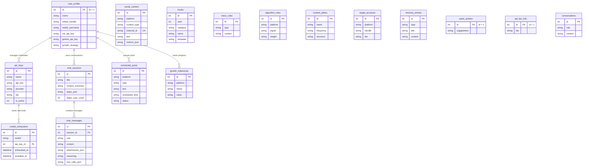

# Soxial Database Schema Documentation

This document describes the complete SQLite database schema for Soxial (`soxial.db`), including table structures, column definitions, constraints, default values, and indexes.

---

## Entity Relationship Diagram Overview

---

## Table Schemas

### 1. `user_profile`
Stores core user identity, branding strategies, voice configurations, and API key references. Single-row table enforced by `CHECK (id = 1)`.

| Column | Data Type | Constraints | Default | Description |
|---|---|---|---|---|
| `id` | `INTEGER` | `PRIMARY KEY, CHECK (id = 1)` | - | Single profile record identifier |
| `name` | `TEXT` | - | `NULL` | User's app profile name (from onboarding/identity) |
| `twitter_handle` | `TEXT` | - | `NULL` | X / Twitter username (without `@`) |
| `twitter_name` | `TEXT` | - | `NULL` | X / Twitter profile display name |
| `reddit_username` | `TEXT` | - | `NULL` | Reddit username (without `u/`) |
| `reddit_display_name` | `TEXT` | - | `NULL` | Reddit profile display name / title |
| `timezone` | `TEXT` | - | `NULL` | Preferred timezone string (e.g. `UTC+1`) |
| `has_premium` | `INTEGER` | - | `0` | Premium status flag (`0` or `1`) |
| `niche` | `TEXT` | - | `NULL` | User's primary domain/niche |
| `specialization` | `TEXT` | - | `NULL` | Specific domain area of expertise |
| `superpower` | `TEXT` | - | `NULL` | Unique differentiator/value prop |
| `primary_goal` | `TEXT` | - | `NULL` | Main objective (e.g. Client acquisition) |
| `target_audience` | `TEXT` | - | `NULL` | Ideal reader / customer description |
| `voice_description` | `TEXT` | - | `NULL` | Desired writing style and tone |
| `avoid_words` | `TEXT` | - | `NULL` | Words or phrases to strictly avoid |
| `brand_primary_color` | `TEXT` | - | `'#3b82f6'` | Primary brand hex color |
| `brand_secondary_color` | `TEXT` | - | `'#1c1c1c'` | Secondary brand hex color |
| `brand_accent_color` | `TEXT` | - | `'#60a5fa'` | Accent brand hex color |
| `style_preset` | `TEXT` | - | `'Modern Clean'` | Visual style preset |
| `zai_api_key` | `TEXT` | - | `NULL` | Primary Z.AI / Zhipu API key |
| `gemini_api_key` | `TEXT` | - | `NULL` | Primary Google Gemini API key |
| `openai_api_key` | `TEXT` | - | `NULL` | Legacy / optional OpenAI key |
| `puter_token` | `TEXT` | - | `NULL` | Auth token for Puter.js fallback |
| `onboarding_complete` | `INTEGER` | - | `0` | Onboarding wizard completion flag |
| `growth_strategy` | `TEXT` | - | `NULL` | Generated AI strategy & playbook |
| `branding_strategy` | `TEXT` | - | `NULL` | Brand positioning notes |
| `tools_stack` | `TEXT` | - | `NULL` | Tools used in daily workflow |
| `monetization_goals` | `TEXT` | - | `NULL` | Commercial / revenue targets |
| `growth_target` | `TEXT` | - | `NULL` | Numerical audience milestones |
| `portfolio_status` | `TEXT` | - | `NULL` | Current portfolio / product state |
| `tone_balance` | `TEXT` | - | `NULL` | Casual vs formal voice weighting |
| `zai_coding_plan` | `INTEGER` | - | `0` | Enables Z.AI coding endpoint |
| `selected_model` | `TEXT` | - | `NULL` | Currently selected AI model ID |
| `created_at` | `TEXT` | - | `datetime('now')` | Account creation timestamp |

---

### 2. `api_keys`
Manages API keys for provider rotation (Google AI Studio and Z.AI / Zhipu).

| Column | Data Type | Constraints | Default | Description |
|---|---|---|---|---|
| `id` | `INTEGER` | `PRIMARY KEY AUTOINCREMENT` | - | Unique API key ID |
| `name` | `TEXT` | `NOT NULL` | - | Key label (e.g. `Primary`, `Key 1`) |
| `api_key` | `TEXT` | `NOT NULL` | - | The raw API key string |
| `provider` | `TEXT` | - | `'google'` | Provider (`google` or `zhipu`) |
| `tier` | `TEXT` | - | `'unknown'` | Detected tier (`free` or `pro`) |
| `is_active` | `INTEGER` | - | `1` | Active key status (`1` = active, `0` = deleted) |
| `created_at` | `TEXT` | - | `datetime('now')` | Key addition timestamp |
| `last_used_at` | `TEXT` | - | `NULL` | Timestamp of last API invocation |

**Indexes:**
- `idx_api_keys_active` ON `api_keys(is_active)`

---

### 3. `model_exhaustion`
Tracks temporary rate limit (429 / quota) cooldowns per model and API key.

| Column | Data Type | Constraints | Default | Description |
|---|---|---|---|---|
| `id` | `INTEGER` | `PRIMARY KEY AUTOINCREMENT` | - | Record identifier |
| `model` | `TEXT` | `NOT NULL` | - | Model string (e.g. `gemini-3.7-flash`) |
| `api_key_id` | `INTEGER` | `FOREIGN KEY -> api_keys(id) ON DELETE CASCADE` | `NULL` | Affected key ID (`NULL` = primary key) |
| `exhausted_at` | `TEXT` | `NOT NULL` | - | Cooldown start timestamp |
| `available_at` | `TEXT` | `NOT NULL` | - | Cooldown end timestamp (default +5 hrs) |
| `created_at` | `TEXT` | - | `datetime('now')` | Entry creation timestamp |

**Indexes:**
- `idx_model_exhaustion_model` ON `model_exhaustion(model)`
- `idx_model_exhaustion_available` ON `model_exhaustion(available_at)`

---

### 4. `chat_sessions`
Represents individual conversation threads with the AI agent.

| Column | Data Type | Constraints | Default | Description |
|---|---|---|---|---|
| `id` | `INTEGER` | `PRIMARY KEY AUTOINCREMENT` | - | Session identifier |
| `title` | `TEXT` | - | `'New Chat'` | Conversation title |
| `context_summary` | `TEXT` | - | `NULL` | Summarized memory context |
| `steps_json` | `TEXT` | - | `NULL` | Verbatim Interaction API steps |
| `steps_user_count` | `INTEGER` | - | `0` | Tracked user message turn count |
| `created_at` | `TEXT` | - | `datetime('now')` | Session creation timestamp |
| `updated_at` | `TEXT` | - | `datetime('now')` | Last activity timestamp |

---

### 5. `chat_messages`
Stores individual messages, reasoning steps, tool calls, and attachments within chat sessions.

| Column | Data Type | Constraints | Default | Description |
|---|---|---|---|---|
| `id` | `INTEGER` | `PRIMARY KEY AUTOINCREMENT` | - | Message identifier |
| `session_id` | `INTEGER` | `NOT NULL, FOREIGN KEY -> chat_sessions(id) ON DELETE CASCADE` | - | Parent chat session ID |
| `role` | `TEXT` | `NOT NULL` | - | Sender role (`user` or `assistant`) |
| `content` | `TEXT` | - | `NULL` | Markdown text content |
| `attachments_json` | `TEXT` | - | `NULL` | JSON array of base64 image attachments |
| `reasoning` | `TEXT` | - | `NULL` | Chain-of-thought thinking text |
| `tool_calls_json` | `TEXT` | - | `NULL` | JSON array of tool calls & results |
| `created_at` | `TEXT` | - | `datetime('now')` | Message timestamp |

---

### 6. `scheduled_posts`
Holds drafted and scheduled posts queued for execution on X or Reddit.

| Column | Data Type | Constraints | Default | Description |
|---|---|---|---|---|
| `id` | `INTEGER` | `PRIMARY KEY AUTOINCREMENT` | - | Post queue identifier |
| `platform` | `TEXT` | `NOT NULL` | - | Target platform (`twitter` or `reddit`) |
| `type` | `TEXT` | - | `NULL` | Content pillar type |
| `text` | `TEXT` | - | `NULL` | Post text body |
| `media_path` | `TEXT` | - | `NULL` | File path to attached media |
| `hashtags` | `TEXT` | - | `NULL` | Associated hashtags |
| `first_reply` | `TEXT` | - | `NULL` | Follow-up first reply text |
| `scheduled_time` | `TEXT` | - | `NULL` | Planned publication ISO datetime |
| `status` | `TEXT` | - | `'draft'` | Status (`draft`, `scheduled`, `posted`, `archived`) |
| `result_json` | `TEXT` | - | `NULL` | Publishing execution payload/response |
| `created_at` | `TEXT` | - | `datetime('now')` | Queue creation timestamp |

---

### 7. `social_content`
Local persistent archive of fetched user posts, replies, and comments from social platforms.

| Column | Data Type | Constraints | Default | Description |
|---|---|---|---|---|
| `id` | `INTEGER` | `PRIMARY KEY AUTOINCREMENT` | - | Record identifier |
| `platform` | `TEXT` | `NOT NULL` | - | Platform (`twitter` or `reddit`) |
| `content_type` | `TEXT` | `NOT NULL` | - | Type (`post`, `reply`, `comment`) |
| `external_id` | `TEXT` | `NOT NULL` | - | Platform post/comment ID |
| `author_handle` | `TEXT` | - | `NULL` | Author handle/username |
| `subreddit` | `TEXT` | - | `NULL` | Subreddit name (Reddit items) |
| `title` | `TEXT` | - | `NULL` | Post title |
| `text` | `TEXT` | - | `NULL` | Post body or reply text |
| `metrics_json` | `TEXT` | - | `NULL` | Engagement metrics (likes, score, etc.) |
| `data_json` | `TEXT` | `NOT NULL` | - | Complete raw API payload |
| `posted_at` | `TEXT` | - | `NULL` | Original publishing timestamp |
| `fetched_at` | `TEXT` | - | `datetime('now')` | Fetch timestamp |

**Constraints:**
- `UNIQUE(platform, content_type, external_id)`

**Indexes:**
- `idx_social_content_platform_type` ON `social_content(platform, content_type, posted_at DESC)`

---

### 8. `hooks`
Library of hook opening frameworks for social media posts.

| Column | Data Type | Constraints | Default | Description |
|---|---|---|---|---|
| `id` | `INTEGER` | `PRIMARY KEY AUTOINCREMENT` | - | Hook ID |
| `rank` | `INTEGER` | `NOT NULL` | - | Performance ranking order |
| `category` | `TEXT` | `NOT NULL` | - | Category (`showcase` or `community`) |
| `name` | `TEXT` | `NOT NULL` | - | Framework title |
| `description` | `TEXT` | - | `NULL` | Hook explanation |
| `why_it_works` | `TEXT` | - | `NULL` | Psychological / algorithmic driver |
| `template` | `TEXT` | - | `NULL` | Fill-in-the-blank template string |
| `niche_examples` | `TEXT` | - | `NULL` | Niche-specific usage examples |
| `performance_notes` | `TEXT` | - | `NULL` | Performance tips |

---

### 9. `voice_rules`
Rules defining the user's voice anti-patterns and required natural elements.

| Column | Data Type | Constraints | Default | Description |
|---|---|---|---|---|
| `id` | `INTEGER` | `PRIMARY KEY AUTOINCREMENT` | - | Rule ID |
| `type` | `TEXT` | `NOT NULL` | - | Rule type (`banned_phrase`, `banned_structure`, `natural_element`) |
| `content` | `TEXT` | `NOT NULL` | - | Specific rule text or banned phrase |

---

### 10. `algorithm_rules`
Platform algorithm ranking signals and weight multipliers.

| Column | Data Type | Constraints | Default | Description |
|---|---|---|---|---|
| `id` | `INTEGER` | `PRIMARY KEY AUTOINCREMENT` | - | Rule ID |
| `platform` | `TEXT` | `NOT NULL` | - | Target platform (`twitter`, `reddit`, etc.) |
| `signal` | `TEXT` | `NOT NULL` | - | Ranking signal name |
| `weight` | `TEXT` | - | `NULL` | Algorithmic weight (`High`, `Exponential`, etc.) |
| `description` | `TEXT` | - | `NULL` | Signal behavior description |

---

### 11. `content_pillars`
Core content categories defining the user's publishing cadence.

| Column | Data Type | Constraints | Default | Description |
|---|---|---|---|---|
| `id` | `INTEGER` | `PRIMARY KEY AUTOINCREMENT` | - | Pillar ID |
| `name` | `TEXT` | `NOT NULL` | - | Pillar title (e.g. `Portfolio Piece`) |
| `description` | `TEXT` | - | `NULL` | Pillar concept and intent |
| `structure` | `TEXT` | - | `NULL` | Structural outline (e.g. `HOOK -> WHAT -> HOW`) |
| `frequency` | `TEXT` | - | `NULL` | Weekly frequency target |
| `platform_adaptations` | `TEXT` | - | `NULL` | Adaptations across platforms |

---

### 12. `target_accounts`
List of high-value accounts and subreddits targeted for engagement.

| Column | Data Type | Constraints | Default | Description |
|---|---|---|---|---|
| `id` | `INTEGER` | `PRIMARY KEY AUTOINCREMENT` | - | Target ID |
| `platform` | `TEXT` | `NOT NULL` | - | Platform (`twitter` or `reddit`) |
| `handle` | `TEXT` | `NOT NULL` | - | Account handle or subreddit name |
| `tier` | `TEXT` | - | `NULL` | Importance tier (`tier1`, `tier2`) |
| `why` | `TEXT` | - | `NULL` | Rationale for targeting |
| `strategy` | `TEXT` | - | `NULL` | Specific engagement approach |

---

### 13. `replies`
Curated voice snippets saved during onboarding and strategy building.

| Column | Data Type | Constraints | Default | Description |
|---|---|---|---|---|
| `id` | `INTEGER` | `PRIMARY KEY AUTOINCREMENT` | - | Reply ID |
| `platform` | `TEXT` | `NOT NULL` | - | Platform (`twitter` or `reddit`) |
| `category` | `TEXT` | `NOT NULL` | - | Category classification |
| `text` | `TEXT` | `NOT NULL` | - | Reply text sample |
| `created_at` | `TEXT` | - | `datetime('now')` | Save timestamp |

---

### 14. `memory_entries`
Long-term memory log covering lessons, audience intelligence, and performance patterns.

| Column | Data Type | Constraints | Default | Description |
|---|---|---|---|---|
| `id` | `INTEGER` | `PRIMARY KEY AUTOINCREMENT` | - | Memory ID |
| `type` | `TEXT` | `NOT NULL` | - | Type (`performance`, `engagement`, `lesson`, `competitor`, `audience`, `milestone`) |
| `platform` | `TEXT` | - | `NULL` | Target platform |
| `title` | `TEXT` | - | `NULL` | Short memory title |
| `content` | `TEXT` | - | `NULL` | Memory observation text |
| `data_json` | `TEXT` | - | `NULL` | Structured data payload |
| `created_at` | `TEXT` | - | `datetime('now')` | Entry timestamp |

---

### 15. `growth_milestones`
Historical metric snapshots (followers, karma, posts count).

| Column | Data Type | Constraints | Default | Description |
|---|---|---|---|---|
| `id` | `INTEGER` | `PRIMARY KEY AUTOINCREMENT` | - | Milestone ID |
| `platform` | `TEXT` | `NOT NULL` | - | Platform (`twitter` or `reddit`) |
| `metric` | `TEXT` | `NOT NULL` | - | Metric name (e.g. `followers`, `comment_karma`) |
| `value` | `TEXT` | - | `NULL` | Recorded value string |
| `note` | `TEXT` | - | `NULL` | Context note |
| `recorded_at` | `TEXT` | - | `datetime('now')` | Snapshot timestamp |

---

### 16. `quick_actions`
Cached home screen quick-action prompt suggestions.

| Column | Data Type | Constraints | Default | Description |
|---|---|---|---|---|
| `id` | `INTEGER` | `PRIMARY KEY CHECK (id = 1)` | - | Single row identifier |
| `suggestions` | `TEXT` | `NOT NULL` | - | JSON array of 5 prompt suggestions |
| `generated_at` | `TEXT` | - | `datetime('now')` | Generation timestamp |

---

### 17. `api_tier_info`
Legacy table from the removed pro/free tier detection. No longer written; kept
so older databases migrate cleanly.

| Column | Data Type | Constraints | Default | Description |
|---|---|---|---|---|
| `id` | `INTEGER` | `PRIMARY KEY CHECK (id = 1)` | - | Single record ID |
| `tier` | `TEXT` | - | `'free'` | Detected tier (`free` or `pro`) |
| `detected_at` | `TEXT` | - | `datetime('now')` | Initial detection timestamp |
| `last_verified_at` | `TEXT` | - | `NULL` | Last verification timestamp |

---

### 18. `conversations` (Legacy / Agent Log)
Audit log for system tool invocations and conversation turns.

| Column | Data Type | Constraints | Default | Description |
|---|---|---|---|---|
| `id` | `INTEGER` | `PRIMARY KEY AUTOINCREMENT` | - | Conversation log ID |
| `role` | `TEXT` | `NOT NULL` | - | Role (`user` or `assistant`) |
| `content` | `TEXT` | `NOT NULL` | - | Text message |
| `tool_name` | `TEXT` | - | `NULL` | Invoked tool name |
| `tool_args` | `TEXT` | - | `NULL` | Invoked tool parameters |
| `tool_result` | `TEXT` | - | `NULL` | Invoked tool output |
| `created_at` | `TEXT` | - | `datetime('now')` | Timestamp |

---

### 19. `onboarding_strategy_drafts`

Isolated, versioned draft of the strategy an onboarding run produced. Active
tables stay untouched until the user approves the draft in review (Plan 12
commit transaction).

| Column | Data Type | Constraints | Default | Description |
|---|---|---|---|---|
| `run_id` | `TEXT` | `PRIMARY KEY` | - | Owning onboarding run |
| `version` | `INTEGER` | `NOT NULL` | `1` | Optimistic-concurrency version (bumped per write) |
| `status` | `TEXT` | `NOT NULL, CHECK` | `'draft'` | Lifecycle (`draft`, `review`, `committed`, `discarded`) |
| `base_snapshot_json` | `TEXT` | `NOT NULL` | - | Active strategy state snapshotted before any agent write |
| `draft_json` | `TEXT` | `NOT NULL` | - | Redacted versioned `StrategyDraftDocument` |
| `validation_json` | `TEXT` | - | `NULL` | Readiness result + recorded gaps captured at review entry |
| `created_at` | `TEXT` | - | `datetime('now')` | Creation timestamp |
| `updated_at` | `TEXT` | - | `datetime('now')` | Last write timestamp |
| `reviewed_at` | `TEXT` | - | `NULL` | When review opened |
| `committed_at` | `TEXT` | - | `NULL` | When the commit transaction succeeded |

**Indexes:**
- `idx_strategy_drafts_status_updated` ON `onboarding_strategy_drafts(status, updated_at DESC)`

---

### 20. `onboarding_enrichment_jobs`

Durable background jobs that expand an approved strategy (hooks, targets,
cadence notes, memory) after the user enters chat. One live job per run.

| Column | Data Type | Constraints | Default | Description |
|---|---|---|---|---|
| `id` | `TEXT` | `PRIMARY KEY` | - | Job ID (`enj_...`) |
| `run_id` | `TEXT` | `NOT NULL` | - | Owning committed run |
| `status` | `TEXT` | `NOT NULL, CHECK` | `'pending'` | (`pending`, `running`, `succeeded`, `failed`, `cancelled`) |
| `attempt` | `INTEGER` | `NOT NULL` | `0` | Attempts used |
| `max_attempts` | `INTEGER` | `NOT NULL` | `3` | Retry ceiling |
| `stage` | `TEXT` | `NOT NULL` | `'queued'` | Current stage marker for resume |
| `last_error_code` | `TEXT` | - | `NULL` | Terminal failure code |
| `last_error_message` | `TEXT` | - | `NULL` | Bounded redacted failure message |
| `started_at` | `TEXT` | - | `NULL` | First execution start |
| `updated_at` | `TEXT` | - | `datetime('now')` | Last update |
| `completed_at` | `TEXT` | - | `NULL` | Completion timestamp |

**Constraints:**
- `UNIQUE(run_id, status)` — at most one pending/running/succeeded row per run

**Indexes:**
- `idx_enrichment_jobs_status_updated` ON `onboarding_enrichment_jobs(status, updated_at DESC)`
- `idx_enrichment_jobs_run` ON `onboarding_enrichment_jobs(run_id)`

---

### 21. `custom_providers`
User-defined OpenAI-compatible endpoints. Each row carries its own credential
(credential vault ref, never a raw key) and a JSON list of served models; every
model appears in the chat prompt bar as `custom/<provider_id>/<model_id>`.

| Column | Data Type | Constraints | Default | Description |
|---|---|---|---|---|
| `id` | `INTEGER` | `PRIMARY KEY AUTOINCREMENT` | - | Provider row id |
| `name` | `TEXT` | `NOT NULL` | - | Display name |
| `base_url` | `TEXT` | `NOT NULL` | - | OpenAI-compatible API root (no trailing slash) |
| `credential_ref` | `TEXT` | - | `NULL` | Credential vault reference |
| `models_json` | `TEXT` | `NOT NULL` | `'[]'` | JSON `[{id, label}]` of served models |
| `is_active` | `INTEGER` | - | `1` | Soft-delete flag |
| `created_at` | `TEXT` | - | `datetime('now')` | Creation timestamp |

Removal is a soft delete (`is_active = 0`) plus credential-vault cleanup; the
credential itself never leaves the main process.
