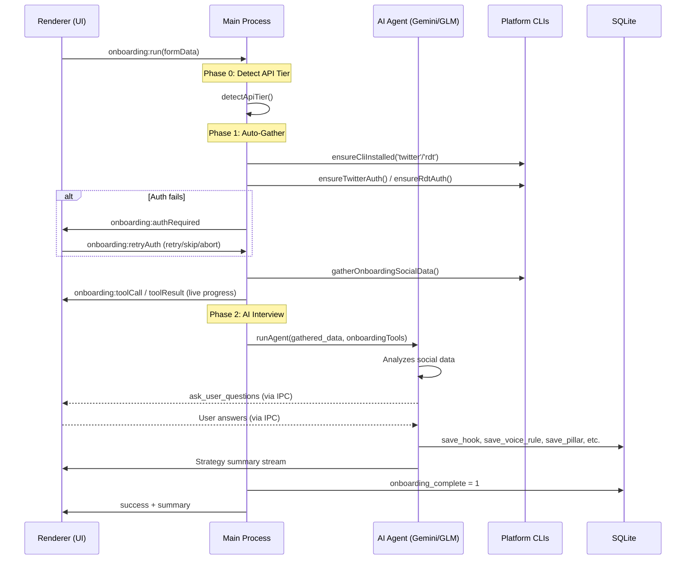

# Soxial Onboarding System — Architecture Analysis

## The Core Idea

Soxial is an **AI-powered social media manager** (Electron desktop app) that onboards users through an **AI-agent-driven interview process**. The onboarding isn't a static form wizard — it's a hybrid system where manual UI steps collect identity/credentials, then an AI agent **gathers social data, interviews the user, and autonomously builds their entire growth strategy** by writing directly to the database.

---

## UI Flow (5 Steps)

| Step | Component | What It Collects |
|------|-----------|------------------|
| **0 — Welcome** | `StepWelcome` | Nothing — splash intro ("Hi, I'm Soxial") |
| **1 — Identity** | `StepIdentity` | Name, timezone, niche, superpower, primary goal (6 MCQ options), voice description |
| **2 — API Keys** | `StepApiKey` | Google AI Studio or Z.AI (Zhipu) API keys with backup key support and coding plan toggle |
| **3 — Platforms** | `StepPlatforms` | Target audience text input; explains auto-detection of X/Reddit from browser cookies |
| **4 — AI Onboarding** | `StepAiOnboarding` | **Everything else** — the AI agent takes over |

> [!IMPORTANT]
> Steps 0–3 are traditional form UI. Step 4 is where the magic happens — it's a full **agentic conversation** running in the Electron main process.

---

## Step 4: The AI Agent Flow (the core)

Step 4 has **three internal phases** orchestrated by the main process (`electron/main/index.ts`):

### Phase 0 — API Tier Detection
Silent background check to determine if the user's API key is `free` or `pro` tier, which affects model selection.

### Phase 1 — Auto-Gather (Data Collection)
1. Installs platform CLI connectors (`twitter`, `rdt`)
2. **Auth gate loop**: Checks browser cookies for X/Reddit sessions
   - If both fail → shows auth required modal with options: Retry / Skip Twitter / Skip Reddit / Abort
   - User can proceed with just one platform
3. Calls `gatherOnboardingSocialData()` which scrapes:
   - Twitter timeline, user posts, followers, likes
   - Reddit subscriptions, post history, etc.
4. All progress is streamed to the UI as tool call/result steps

### Phase 2 — AI Interview
The gathered data is packed into a single massive user message and fed to `runAgent()` (see `electron/main/agent.ts`) with:

- **60 max steps** (generous tool-calling budget)
- **Onboarding-specific fallback chain**: `gemini-3.7-flash → glm-4.7-flash → gemini-3.5-flash-lite`
- **Custom tool set** (`createOnboardingTools()` in `electron/main/agent.ts`) = all regular tools + `ask_user_questions`

The AI agent then:
1. **Analyzes** the scraped social data
2. **Asks 5–8 interview questions** via `ask_user_questions` tool (rendered as a multi-step questionnaire in the UI via `QuestionInput`)
3. **Builds the strategy** by calling DB write tools: `save_hook`, `save_voice_rule`, `save_pillar`, `save_target`, `save_algorithm_rule`, `update_soxial_profile`, etc.
4. **Outputs a summary** streamed as markdown to the conversation UI

---

## IPC Communication Architecture

The onboarding uses a **bidirectional IPC bridge** between renderer and main process:

| IPC Channel | Direction | Purpose |
|---|---|---|
| `onboarding:run` | R→M | Start onboarding with form data |
| `onboarding:chunk` | M→R | Stream AI text output |
| `onboarding:reasoning` | M→R | Stream AI thinking/reasoning |
| `onboarding:toolCall` | M→R | Tool invocation notification |
| `onboarding:toolResult` | M→R | Tool completion notification |
| `onboarding:question` | M→R | AI asks user questions (batch) |
| `onboarding:answer` | R→M | User submits answers |
| `onboarding:authRequired` | M→R | Platform auth needed |
| `onboarding:retryAuth` | R→M | User auth gate response |
| `onboarding:transientRetry` | M→R | Rate limit / transient error retry info |
| `onboarding:checkpoint` | R→M | Save conversation checkpoint |
| `onboarding:getResume` | R→M | Check for resumable run |
| `onboarding:reset` | R→M | Reset `onboarding_complete` flag |

---

## Key Design Patterns

### 1. Question Batching (Single-Shot Interview)
The `ask_user_questions` tool is designed to be called **exactly once** with all questions. The UI renders them as a multi-step questionnaire with prev/next navigation, and all answers are submitted together. This avoids multiple agent round-trips.

### 2. Checkpoint & Resume
- Every significant state change is checkpointed via `saveOnboardingCheckpoint()` (`electron/main/db.ts`)
- On next app launch, `getLatestResumableOnboardingRun()` checks for interrupted runs
- The UI's `startOnboarding()` function checks for resume data and can continue from where it left off, skipping data gathering

### 3. Multi-Model Fallback with Key Rotation
The agent has a sophisticated fallback system:
- **Model fallback chain**: Tries models in order, skipping exhausted ones
- **API key rotation**: Multiple keys per provider; rotates on rate limit (429)
- **Transient retry**: 5 retries with backoff for 500/502/503/network errors
- **Auth error handling**: Rotates keys on 401/403

### 4. Identity Protection
After the AI agent finishes, the system **re-asserts** user-entered identity fields (name, timezone, handles) to prevent the AI from accidentally overwriting them.

---

## Database Schema (Onboarding-Relevant)

The AI agent populates these tables during onboarding:

| Table | Purpose |
|---|---|
| `user_profile` | Single-row user identity + settings + `onboarding_complete` flag |
| `hooks` | Engagement hooks ranked by effectiveness |
| `voice_rules` | Brand voice guidelines (dos/don'ts) |
| `content_pillars` | Content themes/categories |
| `target_accounts` | Accounts to engage with for growth |
| `algorithm_rules` | Platform algorithm optimization rules |
| `replies` | Template reply patterns |
| `api_keys` | Multi-key storage with provider/tier/fingerprint |
| `onboarding_runs` | Checkpoint/resume state for onboarding attempts |
| `api_tier_info` | Detected API tier (free/pro) |

---

## UI Architecture

The UI in `src/features/onboarding/OnboardingPage.tsx` (~1250 lines) is built with:

- **Framer Motion** (`motion/react`) for all transitions — spring physics, `AnimatePresence`, `layoutId` animations
- **Dark theme** — `#050507` background, `zinc-*` color scale, subtle border glows
- **Conversation UI** — Step 4 reuses the chat conversation components (`Message`, `Conversation`, `ChainOfThoughtStep`)
- **Tool call visualization** — each agent tool call appears as a chain-of-thought step with status indicators
- **Reasoning blocks** — collapsible thinking/reasoning display
- **Adaptive bottom bar** — dynamically measures its own height to create proper scroll padding

The form state is managed by `useOnboardingForm()` (`src/features/onboarding/use-onboarding-form.ts`) — a simple `useState` hook tracking the current step + form data dictionary.

---

## Key Source Files

| File | Role |
|---|---|
| `src/components/Onboarding.tsx` | Re-export barrel |
| `src/features/onboarding/OnboardingPage.tsx` | Full onboarding UI (steps 0–4) |
| `src/features/onboarding/use-onboarding-form.ts` | Form state hook |
| `electron/main/index.ts` | IPC handlers, orchestrates phases |
| `electron/main/agent.ts` | AI agent, tool creation, model fallback |
| `electron/main/db.ts` | Database schema, profile CRUD, checkpoints |

---

## Summary

> The onboarding system is essentially a **wizard-to-agent pipeline**: 3 quick form steps collect the minimum viable user context (identity, API keys, platforms), then an AI agent with full database write access autonomously builds a complete social media growth strategy by analyzing real social data and conducting a conversational interview — all within a polished, streaming conversation UI with resilient error handling, checkpointing, and multi-model fallback.
